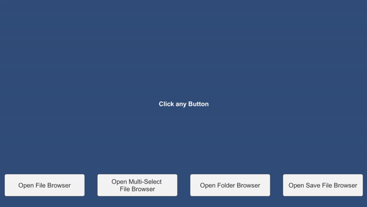

# AnotherFileBrowser

Just an another File Dialog for Unity, with easy implementation. Using Ookii Dialogs. Rather than putting everything in .dll, i've done this simply with a class, so you can extend it based on Ookii Dialogs.



# Getting Started

Download the **latest release** from Releases. Import it to Unity. Or, if you want download the project, just **clone** it.

After importing, change **Change API Compatibility Level** to **_.NET 4.x_**, from `Project Settings -> Player -> Other Settings`. And, change **Scripting Backend** to **_Mono_**.

# Implementation

Implementation is quite easy, but before implementing let's know about **BrowserProperties** constructor.

**BrowserProperties**

```
public class BrowserProperties
{
    public string title; //Title of the Dialog
    public string initialDir; //Where dialog will be opened initially
    public string filter; //aka File Extension for filtering files
    public int filterIndex; //Index of filter, if there is multiple filter. Default is 0.
    public bool restoreDirectory = true; //Restore to last return directory


    public BrowserProperties() { }
    public BrowserProperties(string title) { this.title = title; }
}
```

Make sure to define `AnotherFileBrowser.Windows` namespace.

### Picking a Single File

```
var bp = new BrowserProperties();
bp.filter = "txt files (*.txt)|*.txt|All Files (*.*)|*.*";
bp.filterIndex = 0;

new FileBrowser().OpenFileBrowser(bp, path =>
{
    //Do something with path(string)
    Debug.Log(path);
});
```

### Picking Multiple File(s)

```
var bp = new BrowserProperties();
bp.filter = "txt files (*.txt)|*.txt|All Files (*.*)|*.*";
bp.filterIndex = 0;

new FileBrowser().OpenMultiSelectFileBrowser(bp, path =>
{
    //Do something with path(string[])
    string s = "";
    for (int i = 0; i < path.Length; i++)
    {
        s += path[i] + "\n";
    }

});
```

### Picking Folder Path

```
var bp = new BrowserProperties();
bp.filter = "txt files (*.txt)|*.txt|All Files (*.*)|*.*";
bp.filterIndex = 0;

new FileBrowser().OpenFolderBrowser(bp, path =>
{
    //Do something with path(string)
    Debug.Log(path);
});
```

### Picking Path for Saving File

```
var bp = new BrowserProperties();
bp.filter = "txt files (*.txt)|*.txt";
bp.filterIndex = 0;

new FileBrowser().SaveFileBrowser(bp, "test", ".txt", path =>
{
    //Do something with path(string)
    Debug.Log(path);
});
```

#### Pro-Tips

Use preprocessor for [Platform Dependent Compilation](https://docs.unity3d.com/Manual/PlatformDependentCompilation.html), so there won't be any issue while building for other platforms.

#### IL2CPP Support

I'm facing crashes if try to open dialog from il2cpp build. If you want to try in il2cpp, you need to add `Mono.Posix` & `Mono.WebBrowser` from `C:\Program Files\Unity\Editor\Data\MonoBleedingEdge\lib\mono\gac` to `\Plugins` folder.

There must be a workaround, you can check crash logs after crash. I will try to fix it, if you already fixed it, open a PR, it would be highly appreciated.

#### Android Support

This is only for Windows. You can check out [UnityNativeFilePicker](https://github.com/yasirkula/UnityNativeFilePicker) by Yasirkula. There are plenty of native plugins, but this one support iOS too.

# Contacts

### Srejon Khan

Indie Game Programmer

**Mail:** srejonkhan9@gmail.com
